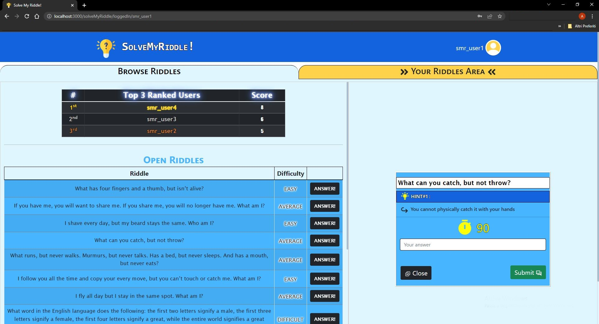

# Exam #2: "Solve My Riddle"
## Student: s306034 VANCINI ALESSANDRO

### Additional information : 

- Client start command :``` npm start```

- Server start command ( for nodemon ) : ```npm run dev ```


## React Client Application Routes

- Route `*` : Default route giving error 404 for page not found
- Route `/`: root route redirecting to `/solveMyRiddle` if not logged in or to `/solveMyRiddle/loggedIn/:username` if logged in
- Route `/solveMyRiddle/login` : page containing the login form ; if already logged in it redirects to `/solveMyRiddle/loggedIn/:username`
- Route `/solveMyRiddle` : if not logged in this route contains the homepage with scoreboard and full list of riddles; if logged in instead it redirects to `/solveMyRiddle/loggedIn/:username`
- Route `/solveMyRiddle/loggedIn/:username` : page for logged in users ( username of the user is a param in the route); it contains two windows : one giving access to all the available open and closed riddles posted by other users ( which can be answered and selected to view their details) and one containing a personal area to post new riddles and view their status and answers; if not logged in it redirects to `/solveMyRiddle`


## API Server
- **POST** `/api/sessions` - *Login*
  - request : 
      * parameters : _None_
      * body :
    ```
    {
        "username": 'smr_user1',
        "password": "testpassword"
    }
    ```
  - response :
    * Code:
        * ```201 Created``` (success)
        * ```401 Unauthorized``` (Invalid data (username or password))
    * Body: _None_
- **GET** `/api/sessions/current`  - *Retrieves session and user data*
  - request :
      * parameters : _None_
      * body : _None_
  - response :
    * Code:
        * ```200 OK``` (success)
        * ```401 Unauthorized``` (error)
    * Body: User data
- **DELETE** `/api/sessions/current'` - *Logout*
  - request : 
      * parameters :_None_
      * body : _None_
  - response :
    * Code:_None_
    * Body: _None_

- **GET** `/api/riddles`  - *Retrieves all riddles in the database*
  - request :
      * parameters : _None_
      * body : _None_
  - response :
    * Code:
        * ```200 OK``` (success)
        * ```500 Internal Server Error``` (error)
    * Body:
    ```
    [
     {
         "id": '47',
         "question": 'What is four-legged but cannot walk?',
         "correctResponse": 'table',
         "difficulty": 'average',
         "hint1": 'Generally made of some type of wood',
         "hint2": 'You quite certainly have one in your kitchen',
         "duration": 200,
         "status": 'closed',
         "author": 'smr_user1',
     },
         {
         "id": '66',
         "question": 'Different lights make me strange, for each one my size will change. What am I?',
         "correctResponse": 'pupil',
         "difficulty": 'average',
         "hint1": 'It is circular shaped',
         "hint2": 'It is in your eye',
         "duration": 200,
         "status": 'open',
         "author": 'smr_user5',
     },
         {
         "id": '55',
         "question": 'I shave every day, but my beard stays the same. Who am I?',
         "correctResponse": 'barber',
         "difficulty": 'easy',
         "hint1": 'He takes care of your hair too',
         "hint2": 'You visit him when your hair/beard has become too long and messy',
         "duration": 50,
         "status": 'closed',
         "author": 'smr_user3',
      },
      ...
    ]
    ```


- **GET** `/api/riddle/:riddleID`  - *Retrieves a riddle by its ID*
  - request :
      * parameters : _riddleID_ (id of the specific riddle)
      * body : _None_
  - response :
    * Code:
        * ```200 OK``` (success)
        * ```500 Internal Server Error``` (error)
    * Body:
    ```
    [
         {
         "id": '55',
         "question": 'I shave every day, but my beard stays the same. Who am I?',
         "correctResponse": 'barber',
         "difficulty": 'easy',
         "hint1": 'He takes care of your hair too',
         "hint2": 'You visit him when your hair/beard has become too long and messy',
         "duration": 50,
         "status": 'closed',
         "author": 'smr_user3',
      }
    ]
    ```

- **GET** `/api/riddles/user`  - *Retrieves all riddles of specific user*
  - request :
      * parameters : _None_
      * body : _None_
  - response :
    * Code:
        * ```200 OK``` (success)
        * ```500 Internal Server Error``` (error)
    * Body:
    ```
    [
     {
         "id": '47',
         "question": 'What is four-legged but cannot walk?',
         "correctResponse": 'table',
         "difficulty": 'average',
         "hint1": 'Generally made of some type of wood',
         "hint2": 'You quite certainly have one in your kitchen',
         "duration": 200,
         "status": 'closed',
         "author": 'smr_user1',
     },
         {
         "id": '66',
         "question": 'Different lights make me strange, for each one my size will change. What am I?',
         "correctResponse": 'pupil',
         "difficulty": 'average',
         "hint1": 'It is circular shaped',
         "hint2": 'It is in your eye',
         "duration": 200,
         "status": 'open',
         "author": 'smr_user1',
     },
         {
         "id": '55',
         "question": 'I shave every day, but my beard stays the same. Who am I?',
         "correctResponse": 'barber',
         "difficulty": 'easy',
         "hint1": 'He takes care of your hair too',
         "hint2": 'You visit him when your hair/beard has become too long and messy',
         "duration": 50,
         "status": 'closed',
         "author": 'smr_user1',
      },
      ...
    ]
    ```

- **GET** `/api/answers/riddle:riddleID`  - *Retrieve all answers of specific riddle by id*
  - request :
      * parameters : _riddleID_ (id of the specific riddle)
      * body : _None_
  - response :
    * Code:
        * ```200 OK``` (success)
        * ```500 Internal Server Error``` (error)
    * Body:
    ```
    [
     {
         "riddleID": '46',
         "answer": 'keychain',
         "author": 'smr_user2',
         "submissionDate": '2022-07-14T11:28:26+02:00Z',
     },
         {
         "riddleID": '46',
         "answer": 'piano',
         "author": 'smr_user3',
         "submissionDate": '2022-07-14T11:30:00+02:00Z',
     },
      ...
    ]
    ```

- **GET** `/api/answers/user`  - *Retrieve all answers of specific user*
  - request :
      * parameters : _None_
      * body : _None_
  - response :
    * Code:
        * ```200 OK``` (success)
        * ```500 Internal Server Error``` (error)
    * Body:
    ```
    [
     {
         "riddleID": '46',
         "answer": 'keychain',
         "author": 'smr_user2',
      },
         {
         "riddleID": '66',
         "answer": 'pupil',
         "author": 'smr_user2',
         },
      ...
    ]
    ```

- **GET** `/api/scores/top`  - *Retrieves top 3 users by score*
  - request :
      * parameters : _None_
      * body : _None_
  - response :
    * Code:
        * ```200 OK``` (success)
        * ```500 Internal Server Error``` (error)
    * Body:
    ```
    [
         {
         "username": 'smr_user4',
         "score": 8,
         },
               {
         "username": 'smr_user3',
         "score": 6,
         },
               {
         "username": 'smr_user5',
         "score": 5,
         }
    ]
    ```

- **POST** `/api/riddle` - *Inserts a new riddle*
  - request : 
      * parameters : _None_
      * body :
    ```
    {
         "question": 'I shave every day, but my beard stays the same. Who am I?',
         "correctResponse": 'barber',
         "difficulty": 'easy',
         "hint1": 'He takes care of your hair too',
         "hint2": 'You visit him when your hair/beard has become too long and messy',
         "duration": 50,
    }
    ```
  - response :
    * Code:
        * ```201 Created``` (success)
        * ```503 Service Unavailable``` (server error)
        * ```422 Unprocessable Entity``` (sent invalid data)
    * Body: _None_

- **POST** `/api/answer` - *Inserts a new answer*
  - request : 
      * parameters : _None_
      * body :
    ```
    {
           "riddleID": "46",
            "answer": "keychain",
    }
    ```
  - response :
    * Code:
        * ```201 Created``` (success)
        * ```503 Service Unavailable``` (server error)
        * ```422 Unprocessable Entity``` (sent invalid data)
    * Body: _None_

- **PATCH** `/api/score` - *Update user score by adding 1/2/3 point(s)*
  - request : 
      * parameters : _None_
      * body : 
    ```
    {
        "gainedPoints": 1
    }
    ```
  - response :
    * Code:
        * ```200 OK``` (success)
        * ```503 Service Unavailable``` (server error)
        * ```422 Unprocessable Entity``` (sent invalid data)
    * Body: _None_

## Database Tables

- Table `USER` - contains user data : (username, hashed password, salt for hashed password, score)
- Table `RIDDLE` - contains all submitted riddles by users identified by username in author column : (id,question,correctResponse,difficulty,hint1,hint2,duration,status,author)
- Table `ANSWER` - contains all submitted answers to specific riddlesIDs by users  identified by username in author column : (riddleID,answer,author,submissionDate)

## Main React Components

- `Views.js` : contains components LoginRoute,Homepage,LoggedinHomepageRoute which make use of all the main components described below in three different cases : logging in, logged in, anonymous user.
- `RiddleEntries` (in `RiddleComponents.js`): used to render the table containing riddles ( both open and closed and also the ones posted by the logged in user).
- `ClosedRiddle` (in `RiddleComponents.js`): used to render the details about riddles with status "closed" : winner,answers,correct response.
- `OpenRiddle` (in `RiddleComponents.js`): used to render a riddle which is in the open state; the riddle is a riddle posted by the logged in user which can see , with this component, submitted answers (refreshed each second) and the countdown relative to the riddle
- `NewRiddleForm` (in `RiddleComponents.js`): renders the form used to post a new riddle
- `RiddleTimer` (in `RiddleComponents.js`): used to create the countdown linked to a specific open riddle
- `AnswerForm` (in `AnswerComponents.js`): component containing the form to submit a new answer; it also contains the riddle timer (if started) and the hints shown at respectively 50% and 25% of the remaining time
- `LoginForm` (in `AuthenticationComponents.js`): component containing the form to login ( username and password)
- `ScoreEntries` (in `ScoreComponents.js`): component which renders the table with top three users with highest scores
- `TopBar` (in `TopBarComponents.js`): component which renders the top bar with logo and user actions ( login, logout)

## Screenshot



## Users Credentials

- username: [smr_user1] , password : [testpassword] 
- username, [smr_user2] , password : [testpassword] 
- username, [smr_user3] , password : [testpassword] 
- username, [smr_user4] , password : [testpassword] 
- username, [smr_user5] , password : [testpassword] 
